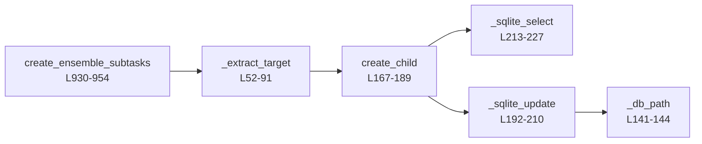
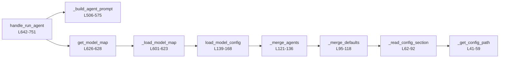
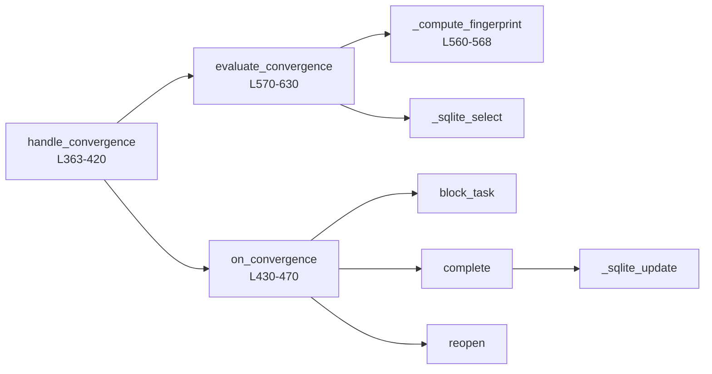
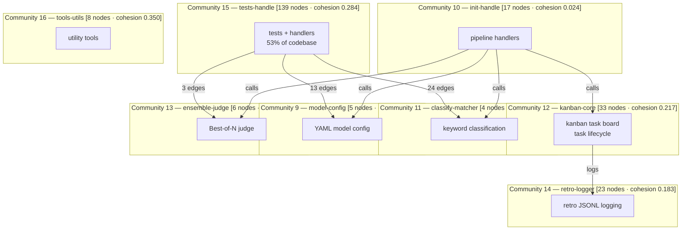

# Hermes Pipeline Plugin — Architecture Graph

> code-review-graph v2.3.7 · 263 nodes · 2078 edges · 8 communities · 34 execution flows · commit 91c4158

---

## 1. Module Dependency Graph (Mermaid)

```mermaid
graph TB
  subgraph "🔵 Test Suite [139 nodes, 53% codebase]"
    TC[Test classify<br/>classification tests]
    TI[Test init<br/>pipeline integration tests]
    TK[Test kanban<br/>kanban convergence tests]
    TKI[Test kanban integration<br/>kanban integration suite]
    TM[Test models<br/>model config tests]
  end

  subgraph "🟠 classify.py — Word Matching"
    CL[classify<br/>keyword classifier]
    CM[_make_word_pattern<br/>regex pattern builder]
    KW[_kw_matches<br/>keyword matching]
    PR[priority<br/>priority calculator]
  end

  subgraph "🟣 models.py — Config Loading"
    LM[load_model_config<br/>YAML model config]
    GC[_get_config_path<br/>config path resolver]
    RC[_read_config_section<br/>YAML reader]
    MD[_merge_defaults<br/>default merger]
    MA[_merge_agents<br/>agent override merger]
  end

  subgraph "🟢 __init__.py — Handlers"
    HC[handle_classify]
    HCO[handle_convergence]
    HS[handle_save]
    HL[handle_load]
    HCL[handle_clear]
    HR[handle_resume]
    HA[handle_advance]
    HP[handle_prompt]
    HM[handle_model]
    HRA[handle_run_agent]
    HER[handle_ensemble_run]
    HEJ[handle_ensemble_judge]
    REG[register]
  end

  subgraph "🟣 kanban.py — Task Board [1015 lines]"
    SB[scan_board<br/>kanban scanner]
    EC[evaluate_convergence<br/>convergence engine]
    OC[on_convergence<br/>convergence handler]
    ADV[advance<br/>agent advancement]
    CTT[create_task_tree<br/>task tree builder]
    PRO[promote<br/>task promoter]
    CMP[complete<br/>task completer]
    BT[block_task]
    UB[unblock]
    REP[reopen]
    CP[create_parent]
    CC[create_child]
    CSP[_cleanup_stale_pipelines]
  end

  subgraph "🔴 ensemble.py — Judge"
    REC[read_ensemble_config]
    EGC[generate_candidates<br/>Best-of-N generator]
    JC[judge_candidates<br/>LLM judge evaluator]
    BJP[_build_judge_prompt<br/>judge prompt builder]
    BJA[build_judge_call_args]
    SUE[should_use_ensemble]
  end

  subgraph "🟡 retro.py — JSONL Logging [506 lines]"
    RL[RetroLogger<br/>retro logger class]
    RL_LOG[log<br/>generic log writer]
    RL_AS[agent_start]
    RL_AD[agent_done]
    RL_CV[convergence log]
    RL_EG[ensemble_gen]
    RL_EJ[ensemble_judge]
    RL_FE[findings_event]
    RL_FD[findings_detail]
    RL_GR[get_retro]
    RL_RR[reset_retro]
    BAP[build_analysis_prompt<br/>retro analysis]
  end

  subgraph "🟤 tools/ — Utilities"
    RS[tools/retro-summary<br/>572 lines]
  end

  %% Tests -> classify (24 CALLS)
  TC --> CL
  TI --> LM
  TK --> EC
  TKI --> SB

  %% classify -> internals
  CL --> CM
  CL --> KW
  CL --> PR

  %% models -> internals
  LM --> GC
  LM --> RC
  LM --> MD
  MD --> MA

  %% handlers -> classify
  HC --> CL

  %% handlers -> models
  HM --> LM
  HRA --> LM

  %% handlers -> kanban
  HCO --> EC
  HCO --> OC
  HS --> CTT
  HL --> SB
  HA --> ADV
  HER --> SUE

  %% handlers -> ensemble
  HER --> EGC
  HEJ --> JC

  %% kanban -> ensemble
  CTT --> EGC

  %% kanban internal
  SB --> CSP
  ADV --> PRO
  ADV --> CMP
  OC --> BT
  OC --> CMP
  OC --> REP
  CTT --> CC
  CTT --> CP
  CTT --> PRO

  %% kanban -> retro
  ADV --> RL_LOG
  HCO --> RL_CV
  HRA --> RL_AS
  HRA --> RL_AD
  HER --> RL_EG
  HEJ --> RL_EJ

  %% retro internal
  BAP --> RL_GR
```

---

## 2. Top Execution Flows (by criticality)

### Flow: create_ensemble_subtasks (criticality 0.463 · 6 nodes · depth 3)

### Flow: handle_run_agent (criticality 0.463 · 9 nodes · depth 5)

### Flow: handle_convergence (criticality 0.458 · 9 nodes · depth 4)

## 3. Community Graph

## 4. Hub Nodes (largest functions by lines)

| Node | File | Lines | Role |
|------|------|-------|------|
| `kanban.py` | kanban.py | **1015** | Task board (largest module) |
| `__init__.py` | __init__.py | **892** | Pipeline handlers |
| `tools/retro-summary` | tools/retro-summary | **572** | Retro summary tool |
| `retro.py` | retro.py | **506** | Retrospective logging |
| `kanban.convergence` | kanban.py | **~120** | Convergence engine |
| `kanban.scan_board` | kanban.py | **~100** | Kanban board scanner |

## 5. Knowledge Gaps

- **34 execution flows** mapped, 5 high-criticality
- **8 communities**, single-file modules (high modularity)
- **No igraph** — community detection via file-based fallback
- **197 nodes documented** in parent document, +66 new from latest build
- **Total: 263 nodes · 2078 edges** · Risk score: low

*Generated by code-review-graph v2.3.7 · hermes-pipeline-plugin @ 91c4158 · 2026-07-20*
